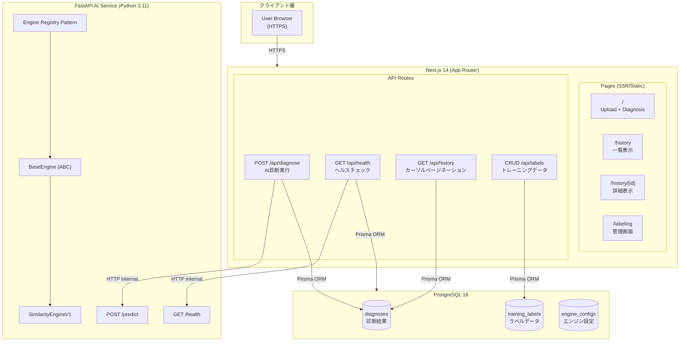
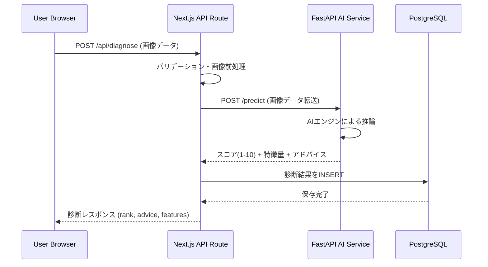
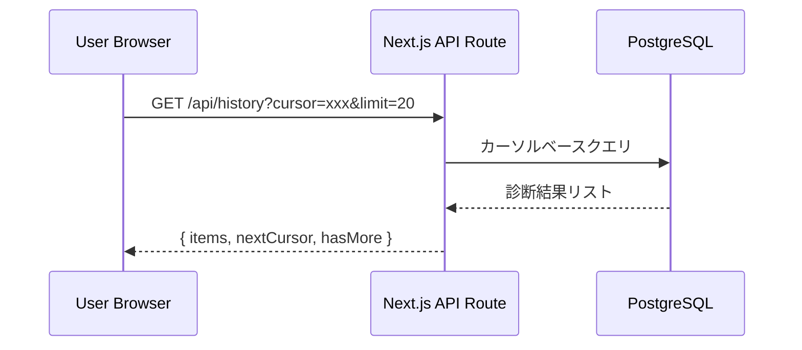
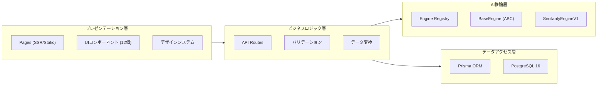
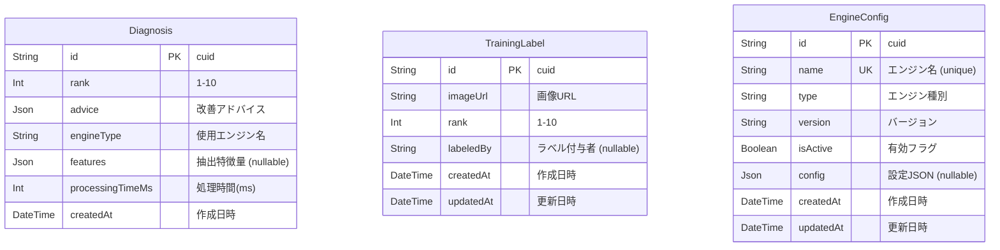
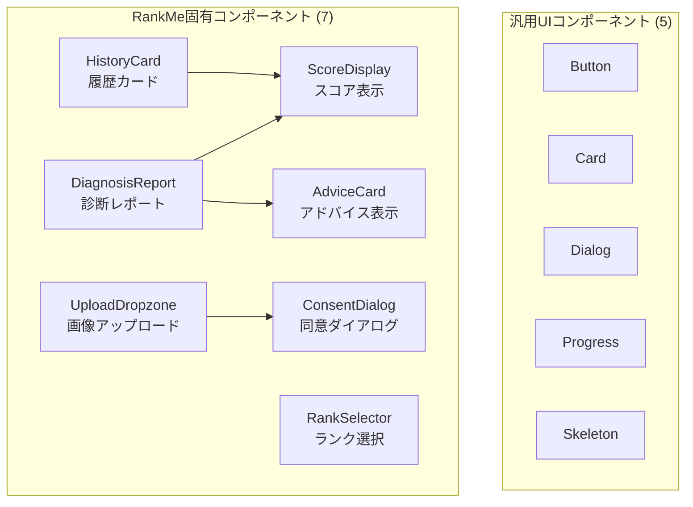
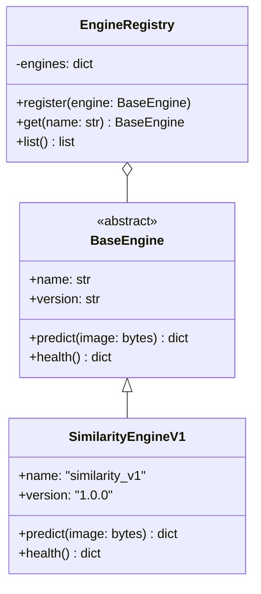
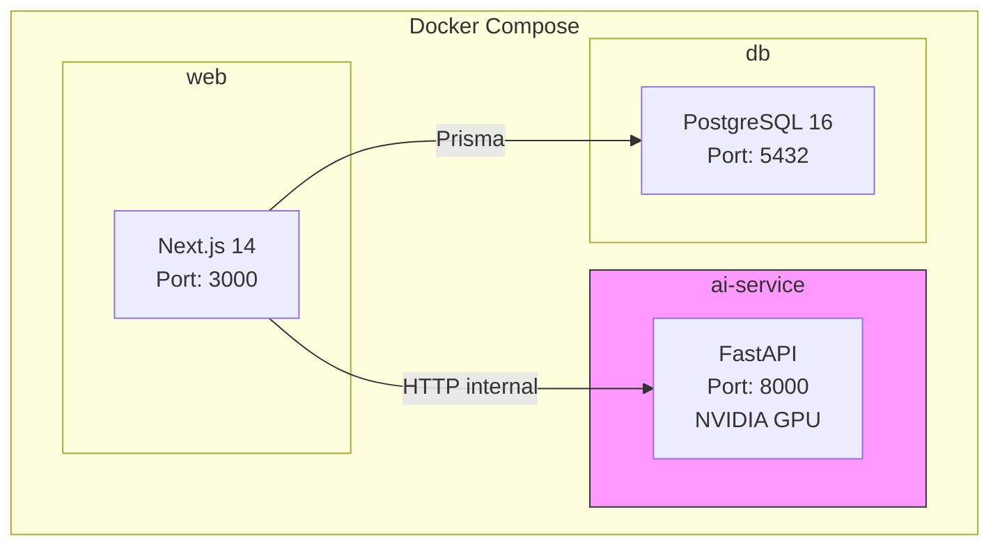

# RankMe アーキテクチャ概要

## 目次

- [システム概要](#システム概要)
- [システムアーキテクチャ](#システムアーキテクチャ)
- [技術スタック](#技術スタック)
- [レイヤー構成](#レイヤー構成)
- [APIエンドポイント](#apiエンドポイント)
- [データモデル](#データモデル)
- [コンポーネント設計](#コンポーネント設計)
- [デザインシステム](#デザインシステム)
- [主要アーキテクチャパターン](#主要アーキテクチャパターン)
- [インフラストラクチャ](#インフラストラクチャ)
- [セキュリティ](#セキュリティ)

---

## システム概要

RankMeは、AIを活用した顔のビジュアル評価プラットフォームです。ユーザーがアップロードした顔画像に対し、1-10のランクでスコアリングを行い、改善アドバイスを提供します。

### 主要機能

- **AI診断**: 顔画像をアップロードし、AIエンジンによる1-10スコア評価を取得
- **改善アドバイス**: スコアに基づく具体的な改善提案（JSON形式で構造化）
- **診断履歴**: 過去の診断結果をカーソルページネーションで効率的に閲覧
- **ラベリング管理**: 管理者向けのトレーニングデータラベリング機能
- **ヘルスチェック**: DB接続・AIサービスの稼働状態監視

---

## システムアーキテクチャ

### 全体構成図



### リクエストフロー（診断）



### リクエストフロー（履歴取得）



---

## 技術スタック

### フロントエンド

| カテゴリ | 技術 | バージョン | 用途 |
|---------|------|-----------|------|
| フレームワーク | Next.js | 14 | App Router, SSR/Static |
| UIライブラリ | React | 18 | コンポーネントベースUI |
| 型システム | TypeScript | 5 | 型安全性 |
| スタイリング | Tailwind CSS | 3.4 | ユーティリティファーストCSS |
| UIコンポーネント | shadcn/ui パターン | カスタム | 再利用可能コンポーネント |
| アイコン | lucide-react | - | SVGアイコン |
| アニメーション | motion (framer-motion) | - | Compositor-onlyアニメーション |
| テーマ | next-themes | - | ダークモード対応 |

### バックエンド

| カテゴリ | 技術 | バージョン | 用途 |
|---------|------|-----------|------|
| APIサーバー | Next.js API Routes | 14 | Node.jsベースAPI |
| ORM | Prisma | 6 | データベースアクセス |
| AIサービス | FastAPI | - | Python AI推論サーバー |
| AI推論 | PyTorch | - | ディープラーニング推論 |
| 画像処理 | Pillow | - | 画像前処理 |
| ランタイム | Python | 3.11 | AIサービスランタイム |

### インフラ

| カテゴリ | 技術 | バージョン | 用途 |
|---------|------|-----------|------|
| データベース | PostgreSQL | 16 | リレーショナルデータストア |
| コンテナ | Docker Compose | - | マルチコンテナオーケストレーション |
| GPU | NVIDIA GPU サポート | - | AI推論高速化 |

---

## レイヤー構成



---

## APIエンドポイント

### Next.js API Routes

| メソッド | エンドポイント | 説明 | リクエスト | レスポンス |
|---------|--------------|------|-----------|-----------|
| `POST` | `/api/diagnose` | AI診断実行 | 画像データ (multipart/form-data) | `{ rank, advice, features, processingTimeMs }` |
| `GET` | `/api/health` | ヘルスチェック | - | `{ db: status, ai: status }` |
| `GET` | `/api/history` | 診断履歴取得 | `?cursor=&limit=` | `{ items[], nextCursor, hasMore }` |
| `GET` | `/api/labels` | ラベル一覧取得 | クエリパラメータ | `{ labels[] }` |
| `POST` | `/api/labels` | ラベル作成 | `{ imageUrl, rank, labeledBy }` | `{ label }` |
| `PUT` | `/api/labels/:id` | ラベル更新 | `{ rank, labeledBy }` | `{ label }` |
| `DELETE` | `/api/labels/:id` | ラベル削除 | - | `{ success }` |

### FastAPI AI Service

| メソッド | エンドポイント | 説明 | リクエスト | レスポンス |
|---------|--------------|------|-----------|-----------|
| `POST` | `/predict` | AI推論実行 | 画像データ | `{ rank, features, advice }` |
| `GET` | `/health` | AIサービスヘルスチェック | - | `{ status, engine }` |

---

## データモデル

### ER図



### Prismaスキーマ定義

```prisma
model Diagnosis {
  id              String   @id @default(cuid())
  rank            Int      // 1-10
  advice          Json     // 構造化された改善アドバイス
  engineType      String   // 使用されたAIエンジン名
  features        Json?    // 抽出された特徴量（オプション）
  processingTimeMs Int     // 推論処理時間（ミリ秒）
  createdAt       DateTime @default(now())

  @@map("diagnoses")
}

model TrainingLabel {
  id        String   @id @default(cuid())
  imageUrl  String   // ラベル対象画像のURL
  rank      Int      // 1-10のラベル値
  labeledBy String?  // ラベル付与者名
  createdAt DateTime @default(now())
  updatedAt DateTime @updatedAt

  @@map("training_labels")
}

model EngineConfig {
  id        String   @id @default(cuid())
  name      String   @unique // エンジン識別名
  type      String   // エンジン種別
  version   String   // バージョン文字列
  isActive  Boolean  @default(false)
  config    Json?    // エンジン固有設定
  createdAt DateTime @default(now())
  updatedAt DateTime @updatedAt

  @@map("engine_configs")
}
```

---

## コンポーネント設計

### コンポーネント一覧（全12コンポーネント）



### コンポーネント詳細

#### 汎用UIコンポーネント

| コンポーネント | 説明 | ベース |
|--------------|------|-------|
| `Button` | アクション実行ボタン（variant対応） | shadcn/ui パターン |
| `Card` | コンテンツカードコンテナ | shadcn/ui パターン |
| `Dialog` | モーダルダイアログ | shadcn/ui パターン |
| `Progress` | 進捗バー表示 | shadcn/ui パターン |
| `Skeleton` | ローディングプレースホルダー | shadcn/ui パターン |

#### RankMe固有コンポーネント

| コンポーネント | 説明 | 主要Props |
|--------------|------|----------|
| `UploadDropzone` | ドラッグ&ドロップ画像アップロード | `onUpload`, `maxSize`, `accept` |
| `ScoreDisplay` | 1-10スコアの視覚的表示 | `rank`, `size`, `animated` |
| `AdviceCard` | 改善アドバイスのカード表示 | `advice`, `category` |
| `DiagnosisReport` | 診断結果の統合レポート | `diagnosis` |
| `ConsentDialog` | 画像使用同意ダイアログ | `onAccept`, `onDecline` |
| `RankSelector` | 管理者向けランク選択UI | `value`, `onChange` |
| `HistoryCard` | 診断履歴一覧のカード | `diagnosis`, `onClick` |

---

## デザインシステム

### デザイントーン

**Clinical-professional** -- 医療・美容の専門性を感じさせるクリーンで信頼感のあるデザイン。

### タイポグラフィ

| 用途 | フォント | フォールバック |
|------|---------|--------------|
| 見出し | DM Sans | Arial, sans-serif |
| 本文 | Noto Sans JP | sans-serif |

### カラーパレット

| 用途 | カラー | 説明 |
|------|--------|------|
| アクセント | `#0891B2` (Teal) | 主要アクション・強調色 |
| ダークモード | 対応済み | next-themes による切替 |

### 10段階ランクカラースケール

CSS変数で定義されたランク別のカラースケール:

```
Rank 1-2  : 赤系 (低スコア)
Rank 3-4  : オレンジ系
Rank 5-6  : 黄系 (中間スコア)
Rank 7-8  : 緑系
Rank 9-10 : ティール/ブルー系 (高スコア)
```

### アクセシビリティ

| 項目 | 基準 |
|------|------|
| WCAG準拠レベル | AA |
| コントラスト比 | 4.5:1 以上 |
| ダークモード | 完全対応 |
| タッチターゲット | 44px 以上 |

---

## 主要アーキテクチャパターン

### 1. Engine Registry Pattern

AIエンジンをプラガブルに管理するレジストリパターン。新しいAIエンジンの追加・切り替えを容易にします。



**利点**:
- 新エンジンの追加が`BaseEngine`を継承するだけで完了
- `EngineConfig`テーブルで有効/無効を動的に切替可能
- A/Bテストやバージョン管理が容易

### 2. Cursor Pagination

大量の診断履歴を効率的に閲覧するためのカーソルベースページネーション。

```
GET /api/history?cursor=clxxxxxx&limit=20

レスポンス:
{
  "items": [...],         // 診断結果配列
  "nextCursor": "clyyy",  // 次ページ用カーソル
  "hasMore": true          // 次ページの有無
}
```

**利点**:
- OFFSETベースと異なり、データ追加時にもページずれが発生しない
- インデックスを活用した高速クエリ
- 無限スクロールUIとの相性が良い

### 3. Lazy Production Guard

AIサービスのURL（`AI_SERVICE_URL`）をモジュールロード時ではなくランタイムで検証するパターン。

```typescript
// NG: モジュールロード時に検証 -> テスト・ビルド時にエラー
const AI_URL = process.env.AI_SERVICE_URL!; // 起動時にクラッシュ

// OK: ランタイムで検証 -> 必要時のみチェック
function getAIServiceURL(): string {
  const url = process.env.AI_SERVICE_URL;
  if (!url) {
    throw new Error("AI_SERVICE_URL is not configured");
  }
  return url;
}
```

**利点**:
- ビルド時・テスト時にAIサービスURLが不要
- 実際にAI呼び出しが発生する時点でのみ検証
- 環境変数の段階的設定が可能

### 4. Compositor-only Animations

60fpsを維持するため、アニメーションプロパティを`transform`と`opacity`のみに制限。

```typescript
// OK: Compositorプロパティのみ
<motion.div
  initial={{ opacity: 0, y: 20 }}
  animate={{ opacity: 1, y: 0 }}
  transition={{ duration: 0.2 }}
/>

// NG: レイアウトプロパティのアニメーション
// width, height, margin, padding など
```

**ルール**:
- アニメーション時間は200ms以下
- `transform`（translate, scale, rotate）と`opacity`のみ使用
- レイアウトプロパティ（width, height, margin, padding）のアニメーション禁止

---

## インフラストラクチャ

### Docker Compose構成



### コンテナ構成

| サービス | イメージ | ポート | 依存関係 |
|---------|--------|--------|---------|
| `web` | Node.js (Next.js 14) | 3000 | db, ai-service |
| `ai-service` | Python 3.11 (FastAPI) | 8000 | - |
| `db` | PostgreSQL 16 | 5432 | - |

### GPU対応

AIサービスコンテナはNVIDIA GPUをサポートし、PyTorchによるGPU推論を利用可能。GPU未搭載環境ではCPUフォールバックで動作します。

---

## セキュリティ

### 考慮事項

| 項目 | 対策 |
|------|------|
| 画像アップロード | ファイルサイズ制限、MIME typeバリデーション |
| APIアクセス | HTTPS通信、レート制限 |
| 内部通信 | Docker内部ネットワーク（外部非公開） |
| データベース | Prisma ORMによるSQLインジェクション防止 |
| 環境変数 | Lazy Production Guardパターンによる安全な参照 |
| 同意管理 | ConsentDialogによる画像使用への明示的同意取得 |

---

## ディレクトリ構造（想定）

```
rankme/
├── src/
│   ├── app/                     # Next.js App Router
│   │   ├── page.tsx             # / (Upload + Diagnosis)
│   │   ├── history/
│   │   │   ├── page.tsx         # /history (List)
│   │   │   └── [id]/
│   │   │       └── page.tsx     # /history/[id] (Detail)
│   │   ├── labeling/
│   │   │   └── page.tsx         # /labeling (Admin)
│   │   └── api/
│   │       ├── diagnose/
│   │       │   └── route.ts     # POST /api/diagnose
│   │       ├── health/
│   │       │   └── route.ts     # GET /api/health
│   │       ├── history/
│   │       │   └── route.ts     # GET /api/history
│   │       └── labels/
│   │           └── route.ts     # CRUD /api/labels
│   ├── components/
│   │   ├── ui/                  # 汎用UIコンポーネント
│   │   │   ├── button.tsx
│   │   │   ├── card.tsx
│   │   │   ├── dialog.tsx
│   │   │   ├── progress.tsx
│   │   │   └── skeleton.tsx
│   │   └── rankme/              # RankMe固有コンポーネント
│   │       ├── upload-dropzone.tsx
│   │       ├── score-display.tsx
│   │       ├── advice-card.tsx
│   │       ├── diagnosis-report.tsx
│   │       ├── consent-dialog.tsx
│   │       ├── rank-selector.tsx
│   │       └── history-card.tsx
│   └── lib/
│       ├── prisma.ts            # Prisma Client
│       └── ai-service.ts        # AI Service Client
├── ai-service/                  # FastAPI AI Service
│   ├── main.py
│   ├── engines/
│   │   ├── base.py              # BaseEngine (ABC)
│   │   ├── registry.py          # Engine Registry
│   │   └── similarity_v1.py     # SimilarityEngineV1
│   └── requirements.txt
├── prisma/
│   └── schema.prisma            # Prismaスキーマ定義
├── docker-compose.yml
└── package.json
```

---

*RankMe Architecture Document -- Generated for CCAGI SDK Project*
